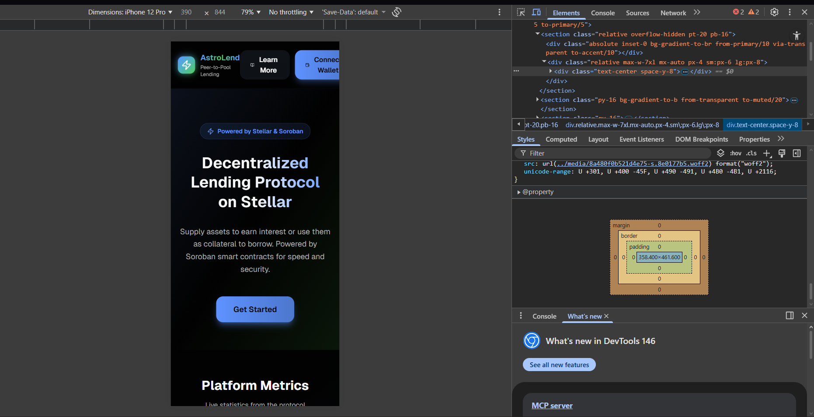

# AstroLend - Decentralized Lending Protocol on Stellar

<div align="center">


**A peer-to-pool lending protocol built on Stellar Testnet using Soroban smart contracts.**

[](https://stellar.org)
[](https://www.rust-lang.org/)
[](https://nextjs.org/)
[](LICENSE)

[Live Demo](#) · [Documentation](#architecture) · [Getting Started](#getting-started)

</div>

---

## 🌐 Live Demo
👉 https://astro-lend-frontend.vercel.app/

## ⚙️ Tech Stack
- Soroban Smart Contracts (Rust)
- Stellar Blockchain
- Next.js (Frontend)
- Tailwind CSS
- Vercel (Deployment)
- GitHub Actions (CI/CD)

## 🔗 Smart Contracts

- **Pool Contract:**  
CCFKPU76M4NE7AJXJINNKOPAEYZMLMYLAXVBRZCCNPCDCBVTR4NMKWPC  

- **Oracle Contract:**  
CDWBM23FFKBX7B7ME7OJFK24C7B7VI5JNDVZCWEK5LXDBNSQOHQAP2CM  

## 📱 Mobile Responsive



## ⚙️ CI/CD
*(Add screenshot next step)*

---

## Overview

AstroLend enables decentralized lending and borrowing on the Stellar network:

- 🏦 **Supply USDC** to the lending pool and earn interest
- 💎 **Deposit XLM** as collateral for borrowing
- 💰 **Borrow USDC** against your XLM collateral (up to 75% LTV)
- 📊 **Monitor health factor** to avoid liquidation
- 📈 **Real-time price feeds** via on-chain oracle
- ⚡ **Automatic liquidation** when positions become unhealthy

---

## Architecture

```
┌─────────────────────────────────────────────────────────────────┐
│                         Frontend (Next.js)                       │
│                    Dashboard, Supply, Borrow UI                  │
└─────────────────────────────────────────────────────────────────┘
                                  │
                                  ▼
┌─────────────────────────────────────────────────────────────────┐
│                     Soroban Smart Contracts                      │
├─────────────────┬──────────────────────┬────────────────────────┤
│   Lending Pool  │  Interest Rate Model │     Price Oracle       │
│                 │                      │                        │
│ • supply()      │ • get_borrow_rate()  │ • set_price()          │
│ • withdraw()    │ • get_supply_rate()  │ • get_price()          │
│ • borrow()      │                      │ • get_xlm_price()      │
│ • repay()       │                      │                        │
│ • deposit_      │                      │                        │
│   collateral()  │                      │                        │
│ • liquidate()   │                      │                        │
└─────────────────┴──────────────────────┴────────────────────────┘
                                  │
                                  ▼
┌─────────────────────────────────────────────────────────────────┐
│                     Stellar Testnet (Soroban)                    │
└─────────────────────────────────────────────────────────────────┘
```

---

## Tech Stack

| Layer | Technology |
|-------|------------|
| **Smart Contracts** | Rust + Soroban SDK v21 |
| **Frontend** | Next.js 14, TypeScript, Tailwind CSS, shadcn/ui |
| **Wallet** | Freighter Wallet integration |
| **Scripts** | TypeScript (deployment, price keeper) |
| **Network** | Stellar Testnet |

---

## Project Structure

```
AstroLend/
├── contracts/                    # Soroban smart contracts
│   ├── Cargo.toml               # Workspace configuration
│   ├── pool/                    # Main lending pool contract
│   │   └── src/lib.rs          # Deposits, borrows, collateral, liquidation
│   ├── interest_rate_model/     # Interest rate calculations
│   │   └── src/lib.rs          # Kinked rate model
│   └── price_oracle/            # On-chain price storage
│       └── src/lib.rs          # XLM/USD, USDC/USD prices
├── scripts/                     # TypeScript utility scripts
│   ├── deploy_all.ts           # One-click deployment
│   ├── update_price.ts         # Oracle price keeper
│   ├── seed_pool.ts            # Pool liquidity seeding
│   ├── fund_user.ts            # Test user funding
│   └── deployment.json         # Deployed contract addresses
├── frontend/                    # Next.js web application
│   ├── app/                    # App router
│   ├── components/             # React components
│   ├── pages/                  # Page components
│   ├── services/               # Soroban API services
│   └── context/                # Wallet context
└── docs/                       # Documentation
```

---

## Health Factor

The **Health Factor (HF)** is the most critical metric in the protocol. It determines the safety of a borrowing position and whether it can be liquidated.

### Formula

```
                    Collateral Value (USD) × Liquidation Threshold
Health Factor = ─────────────────────────────────────────────────────
                              Total Debt Value (USD)
```

### Detailed Calculation

```
HF = (Σ Collateral_i × Price_i × LiqThreshold_i) / (Σ Debt_j × Price_j)
```

Where:
- `Collateral_i` = Amount of collateral asset i
- `Price_i` = Oracle price of asset i in USD
- `LiqThreshold_i` = Liquidation threshold for asset i (80% for XLM)
- `Debt_j` = Amount of borrowed asset j
- `Price_j` = Oracle price of asset j in USD

### Example Calculation

**Scenario:** User deposits 1,000 XLM and borrows 150 USDC

| Variable | Value |
|----------|-------|
| XLM Collateral | 1,000 XLM |
| XLM Price | $0.25 |
| Liquidation Threshold | 80% |
| USDC Debt | 150 USDC |
| USDC Price | $1.00 |

```
Collateral Value = 1,000 × $0.25 = $250
Weighted Collateral = $250 × 0.80 = $200
Debt Value = 150 × $1.00 = $150

Health Factor = $200 / $150 = 1.33
```

### Health Factor Zones

| Health Factor | Status | Color | Action |
|---------------|--------|-------|--------|
| **HF > 1.5** | ✅ Safe | 🟢 Green | Position is healthy |
| **1.0 < HF ≤ 1.5** | ⚠️ Risky | 🟡 Yellow | Consider adding collateral or repaying |
| **HF ≤ 1.0** | 🚨 Liquidatable | 🔴 Red | Position can be liquidated |

### What Happens During Liquidation?

When Health Factor drops below 1.0:

1. **Anyone** can call the `liquidate()` function
2. Liquidator repays up to **50%** of the borrower's debt
3. Liquidator receives equivalent collateral + **5% bonus**
4. Borrower's debt is reduced, collateral is seized

```
Collateral Seized = (Debt Repaid × Debt Price × 1.05) / Collateral Price
```

### Price Impact on Health Factor

If XLM price drops from $0.25 to $0.01:

```
New Collateral Value = 1,000 × $0.01 = $10
New Weighted Collateral = $10 × 0.80 = $8
Debt Value = 150 × $1.00 = $150

New Health Factor = $8 / $150 = 0.053 ❌ LIQUIDATABLE!
```

---

## Interest Rate Model

The protocol uses a **kinked interest rate model** that incentivizes optimal pool utilization:


### Formula

```
If utilization ≤ 80% (Optimal):
  Borrow Rate = Base Rate + (Utilization / Optimal) × Slope₁
  Borrow Rate = 0% + (U / 80%) × 4%

If utilization > 80%:
  Borrow Rate = Base Rate + Slope₁ + ((Utilization - Optimal) / (100% - Optimal)) × Slope₂
  Borrow Rate = 4% + ((U - 80%) / 20%) × 75%
```

### Rate Examples

| Utilization | Borrow APR | Supply APY |
|-------------|------------|------------|
| 20% | 1.0% | 0.18% |
| 50% | 2.5% | 1.13% |
| 80% | 4.0% | 2.88% |
| 90% | 41.5% | 33.6% |
| 100% | 79.0% | 71.1% |


---

## Protocol Parameters

| Parameter | Value | Description |
|-----------|-------|-------------|
| **LTV Ratio** | 75% | Maximum borrow amount relative to collateral |
| **Liquidation Threshold** | 80% | Collateral factor for health calculation |
| **Liquidation Bonus** | 5% | Bonus for liquidators |
| **Close Factor** | 50% | Max debt repayable per liquidation |
| **Base Rate** | 0% | Minimum interest rate |
| **Slope 1** | 4% | Rate increase up to optimal utilization |
| **Slope 2** | 75% | Rate increase above optimal utilization |
| **Optimal Utilization** | 80% | Target pool utilization |
| **Reserve Factor** | 10% | Protocol fee on interest |

---

## Getting Started

### Prerequisites

1. **Rust** (latest stable):
   ```bash
   curl --proto '=https' --tlsv1.2 -sSf https://sh.rustup.rs | sh
   rustup target add wasm32-unknown-unknown
   ```

2. **Stellar CLI**:
   ```bash
   cargo install --locked stellar-cli
   ```

3. **Node.js** (v18+):
   ```bash
   nvm install 18 && nvm use 18
   ```

4. **Freighter Wallet**:
   - Install from [freighter.app](https://www.freighter.app/)
   - Switch to **Testnet** network

### Installation

```bash
# Clone the repository
git clone https://github.com/y4hyya/AstroLend.git

cd AstroLend
# Install frontend dependencies
cd frontend && npm install

# Install script dependencies
cd ../scripts && npm install

# Build contracts
cd ../contracts && cargo build --target wasm32-unknown-unknown --release
```

---

## Deployment

### Quick Deployment (Recommended)

```bash
# 1. Generate deployer account
stellar keys generate deployer-testnet --network testnet

# 2. Fund with Friendbot
curl "https://friendbot.stellar.org/?addr=$(stellar keys address deployer-testnet)"

# 3. Deploy all contracts
cd scripts
npm run deploy-all

# 4. Seed pool with liquidity
npm run seed-pool

# 5. Create test user
npm run fund-user -- --new
```

### Deployed Contracts (Testnet)

After deployment, contract IDs are saved to `scripts/deployment.json`:

```json
{
  "network": "testnet",
  "contracts": {
    "pool": "CAGYPYXFUV7BXUHLCQB7JCLSVT2GF34NMC2YUZKSNQZAGUQLXMAVZIT2",
    "oracle": "CARZ56ARJA6KDA46K4AC5JO7MPRZ6TYVCJ277RTMDQZOSSMLZYSMRIYH",
    "interestRateModel": "CBWCQQK3QHJL2QOIKFIER5FCNIDWVBECKYYH3XH47P2TILCJN2UST33V"
  },
  "tokens": {
    "xlm": "CDLZFC3SYJYDZT7K67VZ75HPJVIEUVNIXF47ZG2FB2RMQQVU2HHGCYSC",
    "usdc": "CBISMBMV3WSS3CQ2MQYUQK374GTO74JDCL7A344Z5NMST5DLE6LHLMEI"
  }
}
```

---

## Running the Frontend

```bash
cd frontend
npm run dev
```

Open [http://localhost:3000](http://localhost:3000) in your browser.

### Features

- 🔗 **Wallet Connection** - Seamless Freighter integration
- 📊 **Dashboard** - Real-time position monitoring
- 💰 **Supply/Withdraw** - Earn interest on USDC
- 💎 **Deposit/Withdraw Collateral** - Manage XLM collateral
- 💸 **Borrow/Repay** - Borrow USDC against collateral
- 🎯 **Health Factor Display** - Visual health indicator with color coding
- 🔴 **Crash/Reset Buttons** - Demo price manipulation (admin only)

---

## Testing Liquidation (Demo)

### Setup

1. **Account 1 (Borrower)**: Deposits 1,000 XLM, borrows 150 USDC
2. **Account 2 (Admin)**: Controls oracle prices

### Demo Flow

```bash
# 1. Check initial health factor (~1.33)
stellar contract invoke --id $POOL --network testnet -- get_health_factor --user $BORROWER

# 2. Crash XLM price to $0.01
stellar contract invoke --id $ORACLE --source $ADMIN_SECRET --network testnet -- set_price --asset XLM --price 100000

# 3. Check new health factor (~0.05 - liquidatable!)
stellar contract invoke --id $POOL --network testnet -- get_health_factor --user $BORROWER

# 4. Execute liquidation
stellar contract invoke --id $POOL --source $ADMIN_SECRET --network testnet -- liquidate \
  --liquidator $ADMIN --borrower $BORROWER --repay_asset USDC --repay_amount 90000000 --collateral_asset XLM

# 5. Reset price
stellar contract invoke --id $ORACLE --source $ADMIN_SECRET --network testnet -- set_price --asset XLM --price 2500000
```

---

## Network Configuration

| Network | RPC URL | Passphrase |
|---------|---------|------------|
| **Testnet** | https://soroban-testnet.stellar.org | Test SDF Network ; September 2015 |
| Futurenet | https://rpc-futurenet.stellar.org | Test SDF Future Network ; October 2022 |

---

## Security

⚠️ **This protocol is in development and unaudited.** Do not use with real assets.

### Known Considerations

- Oracle prices are admin-controlled (for demo purposes)
- No governance mechanism implemented
- Single-asset collateral support (XLM only)

---

## Contributing

Contributions are welcome! Please:

1. Fork the repository
2. Create a feature branch
3. Make your changes
4. Submit a pull request

---

## License

MIT License - see [LICENSE](LICENSE)

---

## Links

- 🌐 [Stellar Documentation](https://developers.stellar.org/)
- 📚 [Soroban Documentation](https://soroban.stellar.org/docs)
- 🔐 [Freighter Wallet](https://www.freighter.app/)
- 🐙 [GitHub Repository](https://github.com/y4hyya/AstroLend)

---

<div align="center">

**Built with ❤️ on Stellar**

</div>
